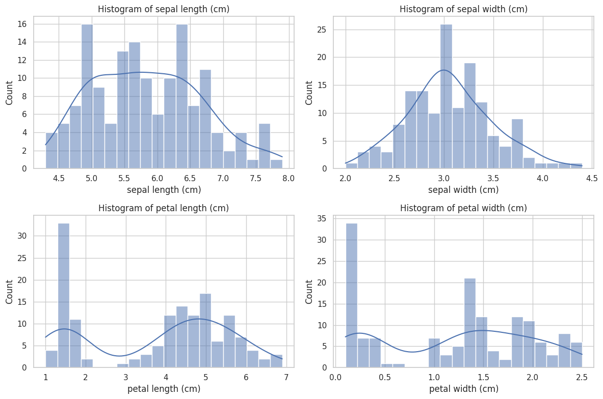
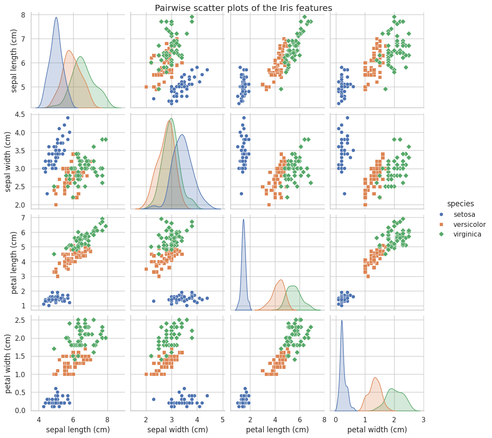
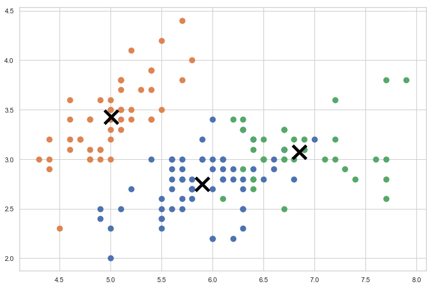

## Usage
This project looks at classifying the iris dataset with the features 'sepal length (cm)', 'sepal width (cm)', 'petal length (cm)', and 'petal width (cm)'

Run the python files prepended with run_, e.g.,
```
python run_kmeans.py
```
To adjust parameters such as plotting, adjust the inputs at the top of the source code.

## Credit
Much of this work is derived from other sources, see files for sources.

## Example Output
Histogram output of the preprocessing:


Scatter plot output of the preprocessing:


Example output of KMeans between `sepal width (cm)` and `petal width (cm)`:


Example output of Logistic Regression:
```
Test Set Accuracy: 0.9555555555555556

Confusion Matrix:
 [[18  0  0]
 [ 0 10  0]
 [ 0  2 15]]

Classification Report:
               precision    recall  f1-score   support

           0       1.00      1.00      1.00        18
           1       0.83      1.00      0.91        10
           2       1.00      0.88      0.94        17

    accuracy                           0.96        45
   macro avg       0.94      0.96      0.95        45
weighted avg       0.96      0.96      0.96        45

KFold Cross-Validation Results (Accuracy): ['0.923', '1.000', '0.846', '1.000', '0.846', '0.923', '0.917', '0.833', '1.000', '0.917', '0.917', '1.000']
Mean Accuracy: 0.927
```